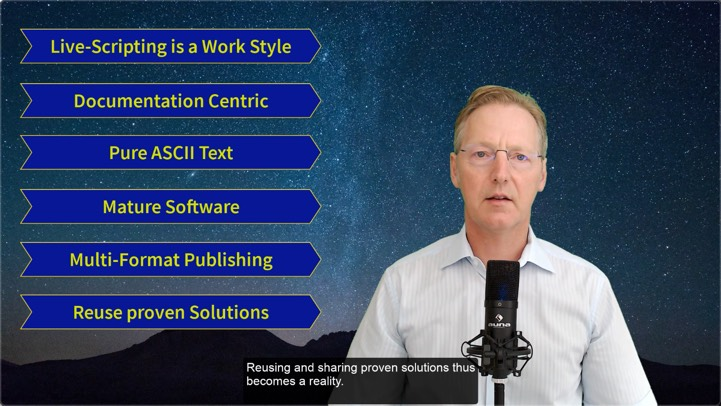
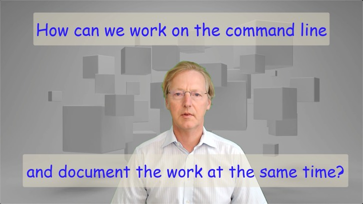
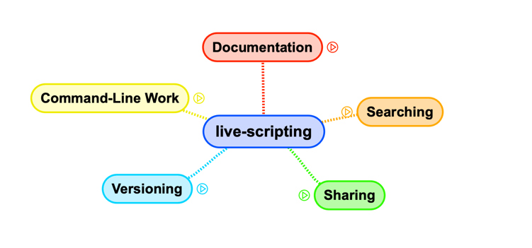
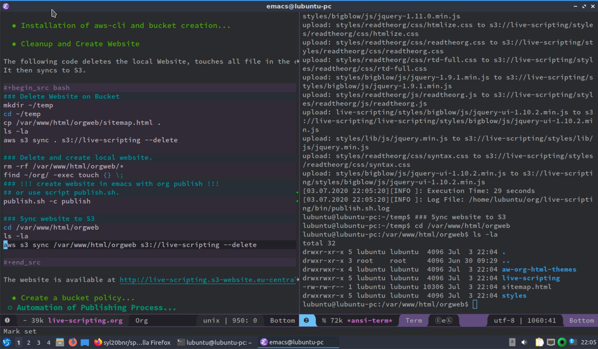
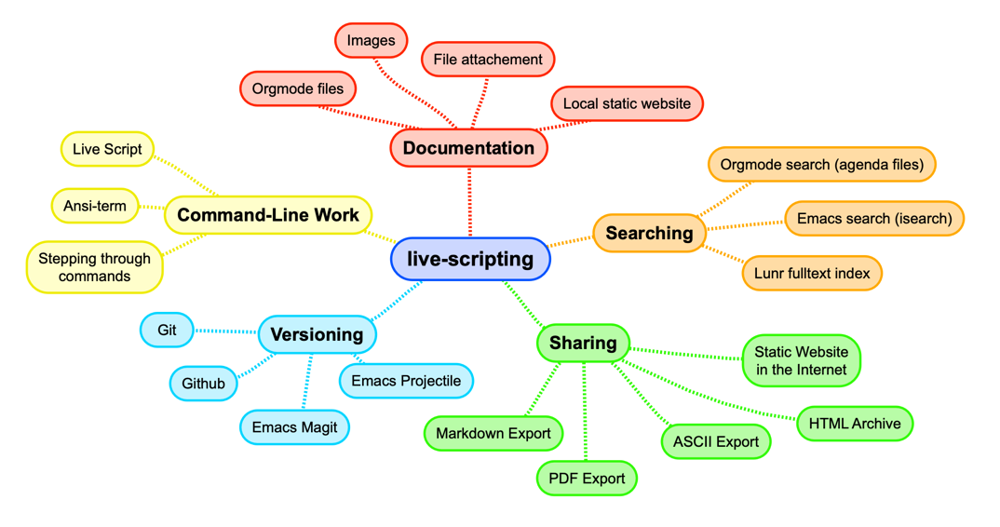

# Introduction

This is the project page of the life-scripting project : <http://live-scripting.s3-website.eu-central-1.amazonaws.com/orgweb/live-scripting/live-scripting.html>  
It is created using the live-scripting approach.  
This project is managed on GitHub: <https://github.com/andreaswittmann/live-scripting>  
The project owner is **Andreas Wittmann IT-Beratung GmbH**: <http://www.andreaswittmann.de>  

## Video Presentation
There are Youtube video presenting this project.
The video "Introduction to Live-Scripting" gives a general overview of the whole project.

The video "Basic Live-Scripting" introduces the concept of command line work and documentation in a single step.

## Functional Areas

Live-scripting is an approach to combine work in IT projects, documentation and information retrieval.  
Very much like test-driven development combines testing and coding, live-scripting documents work in command shells, while doing it.  
But live-scripting is much more than that. It encompasses five functional areas as depicted in the following figure.  

  

While working with live-scripting, a lot of documentation can be created easily in a short amount of time. In order for this information to be usable, live-scripting includes various search capabilities. Sharing of information is vital for any project. Live-scripting offers different sharing options. Since the basis of live-scripting documentation is ASCII text, versioning with source code control systems is very effective and supported by this approach.  

## The Problem

Since more than 30 years and even now, IT-work in many case is command shell centric. For many IT professionals the bash or other shells constitute a major part of their work. Sophisticated commands are constructed during problem resolution. Normally, these commands are deleted at the end of a session. When similar problems arise days or weeks later, similar analysis and solution steps are repeated again. If documentation of the work is required, it is an extra time consuming task. We wish to document this work in an easy way for ourselves and others. This should include an effective search method to quickly find the documented information.  

## The live-scripting approach

Live-scripting is a work methodology based on emacs, which documents work on the command shell while doing it. Instead of entering and executing one command at a time, in live-scripting we use two windows side by side: an editor and a shell. The commands in the editor can then be executed with a single key shortcut in the adjacent shell. This is similar to a debugging session where we can step through code during execution. In the Emacs editor we can jump between commands, repeat them in any order, duplicate and modify them. The editor can be saved into an ascii file at the end of the session.  

  

## Emacs and Org-mode

Emacs is the ideal tool for this approach. The **ansi-term** provides for a robust shell interface within emacs. Since it is an programmable environment, the functions to send a line of code to the ansi-term can be implemented. Furthermore the **org-mode** module is an Emacs **killer app** on its own, adding many features to organize, format and publish the work. At it's core, org-mode is a mark-up language similar to markdown, but much more powerful. Emacs provides elaborated search capabilities across files and projects. The **magit** module is a highly praised interface to git. The fact that most files are plain text, invites the storage in a source code control system like **git**. But org-mode can also handle pictures to add screenshots and attachments for file types like PDFs and others. Org-mode together with a couple of other Emacs modules constitute a cross-media publishing machine which makes it easy to export to HTML, PDF, Markdown, Confluence, and more.  

## Multi Project Website

Live-scripting, as it is presented here, is a configuration that spans multiple projects and publishes the org-files and attachments to a single static website which I call **orgweb**. This can be used locally or be synchronized to a web server in an intranet or on the internet. The web site contains a search pages for the whole site based on **lunr**, which provides a full text search index for finding information across different pages and projects.  

## Technologies

Live-scripting makes intensive use of open source technologies, as depicted in the following mind map.  

  

The live script, which in many situations is the basis in this approach, is edited in Emacs, preferably using the org-mode module of Emacs. The shell commands are executed in the Emacs Ansi-term module, which is a terminal emulator written in lisp. The work is documented in an Emacs Orgmode file which is a powerful markup language. Images, Screenshots and other file attachments can be integrated via drag and drop. Using the Emacs org-publish module, a local static website is created, which uses a beautiful CSS style sheet, featuring a responsive design and easy navigation. For information retrieval the excellent Emacs search capabilities are used. The website uses a search function provided by Luna, which is an open source full-text search engine written in java script. For sharing a across the internet, the local website can be synchronized to a web server or to an Amazon S3 based website. The whole website can also be packed as an HTML archive. Individual org-mode files can be exported to PDF, formatted ASCII text, markdown and more. versioning is done using git which is perfectly supported by the Emacs Magit module. The git projects can be pushed to an online repository like GitHub or others. The Emacs Projectile module supports the multi-project approach of live-scripting.  

You can read more at the live-scripting project page.  <http://live-scripting.s3-website.eu-central-1.amazonaws.com/orgweb/live-scripting/live-scripting.html>  
